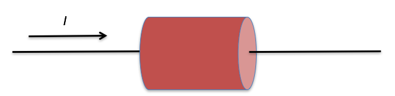

<section data-markdown>

In the interior of a metal in static equilibrium the charge density $\rho$ is:

1. zero always.
2. never zero.
3. sometimes zero, sometime non-zero, depending on the conditions.

Note:
* Correct Answer: A
</section>

<section data-markdown>

## Announcements

* Project homework will be graded tonight
  * Use GitHub Desktop to sync for feedback
  * Please come see me ASAP if you need help with GitHub
* Homework 2 posted; due Friday (Project HW due Monday)
* Quiz 1 on Friday
  * Last 20 minutes of class
  * No cheat sheets; all formulas will be provided
  * Solve a Gauss' Law Problem with cylindrical symmetry
  * Sketch a graph of the resulting electric field

</section>

<section data-markdown>

## MOAR Announcements

* CUWiP this weekend!
  * <https://perl.natsci.msu.edu/aps-cuwip-at-msu/>
* PA Undergrad Brown Bag Lunch
  * Tomorrow 12-1 in 1400 BPS
* Help session starts this week
  * 6:15pm-7:15pm in 1300 BPS
  * Room is available until 8pm

</section>

<section data-markdown>

Which of the following is a correct statement of charge conservation?

1. $\frac{dQ_{enc}}{dt} = -\int \mathbf{J}\cdot d\mathbf{l}$
2. $\frac{dQ_{enc}}{dt} = -\int \mathbf{J}\cdot d\mathbf{A}$
3. $\frac{dQ_{enc}}{dt} = -\int \nabla \cdot \mathbf{J}\,d\tau$
4. $\frac{dQ_{enc}}{dt} = -\nabla \cdot \mathbf{J}$
5. None of these or *more* than one of these

Note:
* Correct Answer: E (it's B and C; connected by divergence theorem)
</section>

<section data-markdown>

For everyday currents in home electronics and wires, which answer is the order of magnitude of the instantaneous speed of the electrons in the wire?

1. more than km/s
2. m/s
3. mm/s
4. $\mu$m/s
5. nm/s

Note:
* Correct Answer: A - using kT = 1/40 eV
</section>

<section data-markdown>

An electric current $I$ flows along a copper wire (low resistivity) into a resistor made of carbon (high resistivity) then back into another copper wire. In which material is the electric field largest?

1. In the copper wire
2. In the carbon resistor
3. It's the same in both copper and carbon
4. It depends on the sizes of the copper and carbon

Note:
* Correct Answer: D, normally B, but it will depend on the relative sizes (if the wire gets really small!)

</section>

<section data-markdown>

**Activity**: A copper cylinder is machined to have the following shape.  The ends are connected to a battery so that a current flows through the copper.

Rank order (from greatest to smallest, e.g. A=C>B)

Magnitude of E field, Conductivity, Current, & Current Density

</section>

<section data-markdown>

Inside this resistor setup, (real world, finite sizes!) What does the E field look like inside ?

1. Must be uniform and horizontal
2. Must have some nonuniformity, due to fringing effects!

</section>

<section data-markdown>

Inside this resistor setup, what can you conclude about the current density $\mathbf{J}$ near the side walls (in steady state)?

1. Must be exactly parallel to the wall
2. Must be exactly perpendicular to the wall
3. Could have a mix of parallel and perp components
4. No obvious way to decide!?

Note:
* Correct Answer: A (otherwise current leaks out or there's accumulation!)

</section>

<section data-markdown>

**Activity:** Consider two spheres (radii $a$ and $b$ with $b$>$a$) that are constructed so that the larger one surrounds the smaller one. Between them is a material with conductivity $\sigma$. A potential difference of $V$ is maintained between them with the inner sphere at higher potential.

* What is the current $I$ flowing between the spheres in terms of the known variables?
* How does your result relate to Ohm's Law?

Hint: Assume a uniform charge $+Q$ distributed over the inner sphere and use Gauss' Law to find $\mathbf{E}$.

</section>
