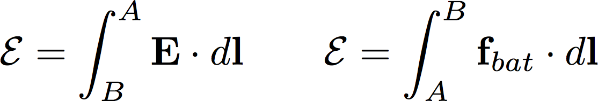

<section data-markdown>

Recall the machined copper from last class, with steady current flowing left to right through it

In the "necking down region" (somewhere in a small-ish region around the head of the arrow), do you think

1. $\nabla \cdot \mathbf{E} = 0$
2. $\nabla \cdot \mathbf{E} \neq 0$

Note:
* Correct Answer: A

</section>

<section data-markdown>

Recall the machined copper from last class, with steady current flowing left to right through it

In steady state, do you expect there will be any surface charge accumulated anywhere on the walls of the conductor?

1. Yes
2. No

Note:
* Correct Answer: A

</section>

<section data-markdown>

Quiz #1 was a fair assessment.

1. Strongly Agree
2. Agree
3. Neutral
4. Disagree
5. Strongly Disagree

</section>

<section data-markdown>

I had enough time to complete Quiz #1.

1. Strongly Agree
2. Agree
3. Neutral
4. Disagree
5. Strongly Disagree

</section>

<section data-markdown>

## Announcements

* Quiz #1 is graded. Average: 83%
  * Would you like emailed grade reports after each quiz?
* Homework 3 is posted; Due Monday Jan 30th
  * Turn in to Kim Crosslan by 4pm
* **No Class on Monday, Jan 30**  - DC out of town
  * Will be available by text and email
  * Homework 4 will be posted

</section>

<section data-markdown>

$\mathcal{E} = \oint \mathbf{E} \cdot d\mathbf{l}$

EMF ($\mathcal{E}$) is the line integral of the total force per unit charge around a closed loop.
The units of EMF are:   

1. Farads
2. Joules
3. Amps, (that’s why current flows.)
4. Newtons, (that’s why it’s called emf)
5. Volts

Note:
* Correct Answer: E

</section>

<section data-markdown>

Imagine a charge $q$ able to move around a tube which makes a closed loop. If we want to drive the charge around the loop, we **cannot** do this with E-field from a single stationary charge.

Can we drive the charge around the loop with some combination of stationary + and – charges?

1. Yes
2. No

Note:
* Correct Answer: B

</section>

<section data-markdown>

A circuit with a battery with voltage difference $\Delta V$ is attached to a resistor.  The force per charge due to the charges is $\mathbf{E}$.  The force per charge inside the battery is $\mathbf{f} = \mathbf{f}_{bat}  + \mathbf{E}$.

How many of the following statements are true?

A. 0 B. 1 C. 2 D. 3 E. 4

Note:
* Correct Answer: D

</section>
