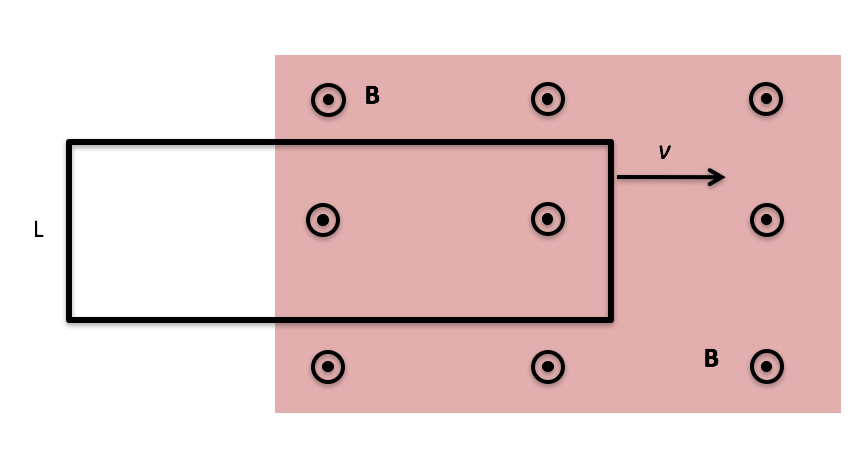

<section data-markdown>

A metal bar moves with constant speed **to the right**. A constant magnetic field points **out of the page**. What happens to the electrons in the bar (in the frame of the moving bar)?

1. Nothing
2. They move upward
3. They move downward
4. They move left
5. They move right

Note:
* Correct Answer: B
</section>

<section>

<section>
    <h2>Surface Charge is Real</h2>
    <video data-autoplay class="stretch" src="./assets/SurfaceCharge.mp4"></video>
</section>

<section data-markdown>

One end of rectangular metal loop enters a region of constant uniform magnetic field $\mathbf{B}$, with initial constant speed $v$, as shown.  What direction is the magnetic force on the loop?

1. Up the "screen" $\uparrow$
2. Down the "screen" $\downarrow$
3. To the right $\rightarrow$
4. To the left $\leftarrow$
5. The net force is zero

Note:
* Correct Answer: D
</section>

<section data-markdown>

One end of rectangular metal loop enters a region of constant uniform magnetic field $\mathbf{B}$, out of page, with constant speed $v$, as shown. As the loop enters the field is there a non-zero emf around the loop?

1. Yes, current will flow CW
2. Yes, current will flow CCW
3. No

Note:
* Correct Answer: A

</section>
