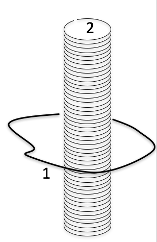
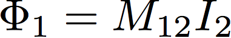
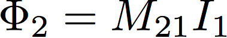
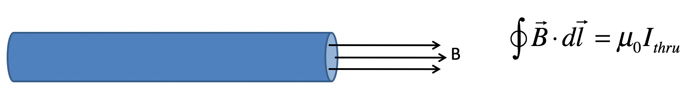
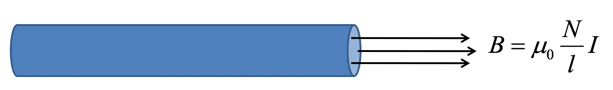

<section data-markdown>

Somewhere in space a magnetic field is changing with time, there are no other sources of electric field field anywhere. In this case, can we define a potential difference betwee two points?

1. Yes, we can always do this
2. Yes, but only if we define the specific path as well
3. No, the story is more complicated than A or B.
4. No, whenever $\nabla \times E \neq 0$, the concept of potential breaks down
5. More than one of these

Note:
* Correct Answer: E

</section>

<section data-markdown>

A loop of wire 1 is around a very long solenoid 2.

= the flux through loop 1 due to the current in the solenoid

= the flux through the solenoid due to the current in loop 1

Which is easier to compute?
1. $M_{12}$
2. $M_{21}$
3. equally difficult to compute

Note:
* Correct Answer: A

</section>

<section data-markdown>

A long solenoid of cross sectional area, $A$,  length, $l$, and number of turns, $N$, carrying current, $I$, creates a magnetic field, $B$, that is spatially uniform inside and zero outside the solenoid. It is given by:

1. $B = \mu_0 {N^2}/{l}$
2. $B = \mu_0 ({N^2}/{l})I$
3. $B = \mu_0 ({N}/{l})I$
4. $B = \mu_0 ({N^2}/{l})AI$

Note:
* Correct Answer: C

</section>

<section data-markdown>

A long solenoid of cross sectional area, $A$,  length, $l$, and number of turns, $N$, carrying current, $I$, creates a magnetic field, $B$, that is spatially uniform inside and zero outside the solenoid. The self inductance is:

1. $L=\mu_0{N^2}/{(IA)}$
2. $L=\mu_0({N}/{l})A$
3. $L=\mu_0({N^2}/{l^2})A$
4. $L=\mu_0({N^2}/{l})A$

Note:
* Correct Answer: D

</section>
