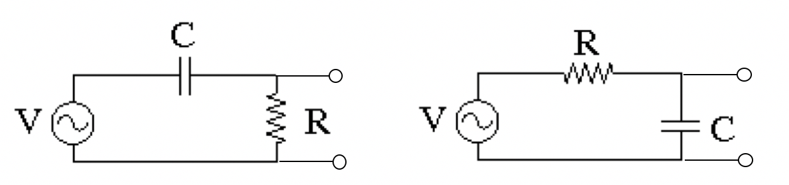

<section data-markdown>

What is $Re\left[\frac{e^{i\omega t}}{1+i}\right]$?

1. $\frac{1}{\sqrt{2}}\cos(\omega t + \pi/4)$
2. $\frac{1}{\sqrt{2}}\cos(\omega t - \pi/4)$
3. $\frac{1}{{2}}\cos(\omega t + \pi/4)$
4. $\frac{1}{{2}}\cos(\omega t - \pi/4)$
5. Something else

Note:
* Correct Answer: B

</section>

<section data-markdown>

## Announcements
* Quiz 3 (next Friday 2/17) - RLC circuits
  * Solve a circuit problem using the phasor method
  * Discuss limits on the response and how it might act as a filter

</section>

<section data-markdown>

AC voltage $V$ and current $I$ vs time $t$ are as shown:

The graph shows that..

1. $I$ leads $V$  ( $I$ peaks before $V$ peaks )
2. $I$ lags $V$    ( $I$ peaks after $V$ peaks )
3. Neither

Note:
* Correct Answer: B

</section>

<section data-markdown>
Suppose you have a circuit driven by a voltage:
$$V(t)=V_0\cos(\omega t)$$

You observe the resulting current is:
$$I(t) = I_0\cos(\omega t-\pi/4)$$

Would you say the current is

1. leading
2. lagging

the voltage by 45 degrees?

Note:
* Correct Answer: B
</section>

<section data-markdown>
Two LR circuits driven by an AC power supply are shown below.

Which circuit is a low pass filter?

1. The left circuit
2. The right circuit
3. Both circuits
4. Neither circuit

Note:
* Correct Answer: B

</section>

<section data-markdown>
Two RC circuits driven by an AC power supply are shown below.

Which circuit is a high pass filter?

1. The left circuit
2. The right circuit
3. Both circuits
4. Neither circuit

Note:
* Correct Answer: A

</section>
