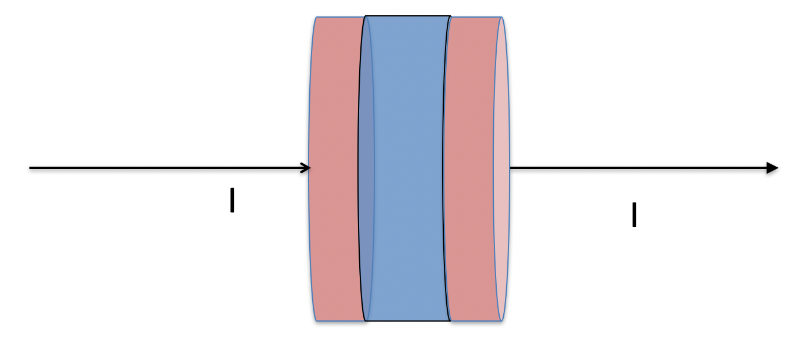

<section data-markdown>

Our global statement of energy conservation is:
$$\dfrac{dU_q}{dt} + \dfrac{dU_e}{dt} = -\iint \mathbf{S}\cdot d\mathbf{A}$$
Which term describes that energy of the electromagnetic field?

1. $\frac{dU_q}{dt}$
2. $\frac{dU_e}{dt}$
3. $-\iint \mathbf{S}\cdot d\mathbf{A}$
4. ???

Note:
* Correct Answer: B
</section>

<section data-markdown>

Our global statement of energy conservation is:
$$\dfrac{dU_q}{dt} + \dfrac{dU_e}{dt} = -\iint \mathbf{S}\cdot d\mathbf{A}$$
What does the integral term (without the minus sign) refer to?

2. Total energy coming in
3. Total energy going out
3. Rate of total energy coming in
4. Rate of total energy going out

Note:
* Correct Answer: D
</section>

<section data-markdown>
## Announcements
* Problem 4.3 on this past week's homework is completely extra credit
  * My sincerest apologies for problems 3.5 and 4.3
  * We can talk about 3.5 if y'all want (it's super interesting)
* Quiz (next Friday 3/3) (Topic discussed this Friday!)
* Your papers are due next Friday (3/3) by 5pm
  * As usual, you will use GitHub to turn them in.
</section>

<section data-markdown>

Consider a current $I$ flowing through a cylindrical resistor of length $L$ and radius $a$ with voltage $V$ applied. What is the E field inside the resistor?

1. $(V/L) \hat{z}$
2. $(V/L) \hat{\phi}$
3. $(V/L) \hat{s}$
4. $(Vs/L^2) \hat{z}$
5. None of the above

Note:
* Correct Answer: A
</section>

<section data-markdown>
Consider a current $I$ flowing through a cylindrical resistor of length $L$ and radius $a$ with voltage $V$ applied. What is the B field inside the resistor?

1. $(I\mu_0/2\pi s) \hat{\phi}$
2. $(I\mu_0s/2\pi a^2)  \hat{\phi}$
3. $(I\mu_0/2\pi a)  \hat{\phi}$
4. $-(I\mu_0/2\pi a)  \hat{\phi}$
5. None of the above

Note:
* Correct Answer: B

</section>

<section data-markdown>

Consider a current $I$ flowing through a cylindrical resistor of length $L$ and radius $a$ with voltage $V$ applied.
What is the direction of the $\mathbf{S}$ vector on the outer curved surface of the resistor?

1. $\pm \hat{\phi}$
2. $\pm \hat{s}$
3. $\pm \hat{z}$
4. ???

Note:
* Correct Answer: B
</section>

<section data-markdown>

Consider the cylindrical volume of space bounded by the capacitor plates.  Compute $\mathbf{S} = \mathbf{E} \times \mathbf{B} /\mu_0$  at the outside (cylindrical, curved) surface of that volume.
Which WAY does it point?

1. Always inward
2. Always outward
3. ???

Note:
* Correct Answer: A
</section>

<section data-markdown>

The energies stored in the electric and magnetic fields are:

1. individually conserved for both $\mathbf{E}$ and $\mathbf{B}$, and cannot change.
2. conserved only if you sum the $\mathbf{E}$ and $\mathbf{B}$ energies together.
3. are not conserved at all.
4. ???

Note:
* Correct Answer: C

</section>
