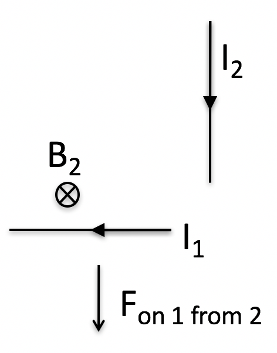
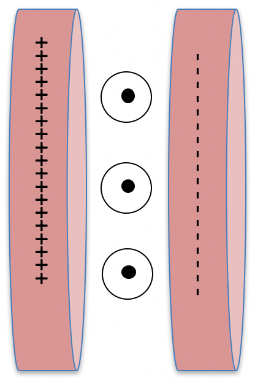

<section data-markdown>

The energies stored in the electric and magnetic fields are:

1. individually conserved for both $\mathbf{E}$ and $\mathbf{B}$, and cannot change.
2. conserved only if you sum the $\mathbf{E}$ and $\mathbf{B}$ energies together.
3. are not conserved at all.
4. ???

Note:
* Correct Answer: C

</section>

<section data-markdown>

## Announcements

* Quiz next Friday (Maxwell Ampere + Poynting Vector)
  * Determine the electric and magnetic field in a situation where there is a displacement current
  * Discuss the direction of the Poynting vector and how it relates to conservation of energy
* Your papers are due next Friday (3/3) by 5pm (20% of your grade BTW)
    * As usual, you will use GitHub to turn them in.

</section>

<section data-markdown>

Newton’s 3rd Law is equivalent to...
1. Conservation of energy
2. Conservation of linear momentum
3. Conservation of angular momentum
4. None of these.  NIII is a separate law of physics.

Note:
* Correct Answer: B

</section>

<section data-markdown>

Consider two point charges, each moving with constant velocity $\mathbf{v}$, charge 1 along the $+x$ axis and charge 2 along the $+y$ axis.
They are equidistant from the origin.

What is the direction of the magnetic force on charge 1 from charge 2? (*You'll need to sketch this! Don’t do it in your head!*)

1. +x
2. +y
3. +z
4. More than one of the above
5. None of the above

Note:
* Correct Answer: B

</section>

<section data-markdown>

Consider two point charges, each moving with constant velocity $\mathbf{v}$, charge 1 along the $+x$ axis and charge 2 along the $+y$ axis.
They are equidistant from the origin.

What is the direction of the magnetic force on charge 2 from charge 1? (You’ll need to sketch this! Don’t do it in your head!)

1. Equal to the answer of the previous question
2. Equal but opposite to the answer of the previous question
3. Something *different* than either of the above.

Note:
* Correct Answer:  C
</section>

<section data-markdown>

Two short lengths of wire carry currents as shown. (The current is supplied by discharging a capacitor.) The diagram shows the direction of the force on wire 1 due to wire 2.

What is the direction of the force on wire 2 due to wire 1?
1. Right
2. Left
3. Up
4. Down

Note:
* Correct Answer: A

</section>

<section data-markdown>

Consider a charged capacitor placed in a uniform B field
in the $+y$ direction. $z$ points along the capacitor axis, so that $x$ points upward.

Which way does the stored field momentum in this system point?

1. $\pm \hat{x}$
2. $\pm \hat{y}$
3. $\pm \hat{z}$
4. Zero!

Note:
* Correct Answer: A

</section>

<section data-markdown>

Now "short out" this capacitor with a small wire.
As the current flows, (while the capacitor is discharging)...

which way does the magnetic force
push the wire (and thus, the system)?

1. $\pm \hat{x}$
2. $\pm \hat{y}$
3. $\pm \hat{z}$
4. Zero!

Note:
* Correct Answer: A

</section>
