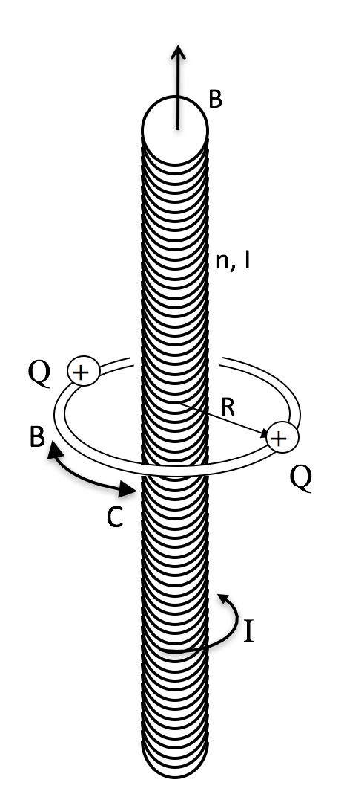
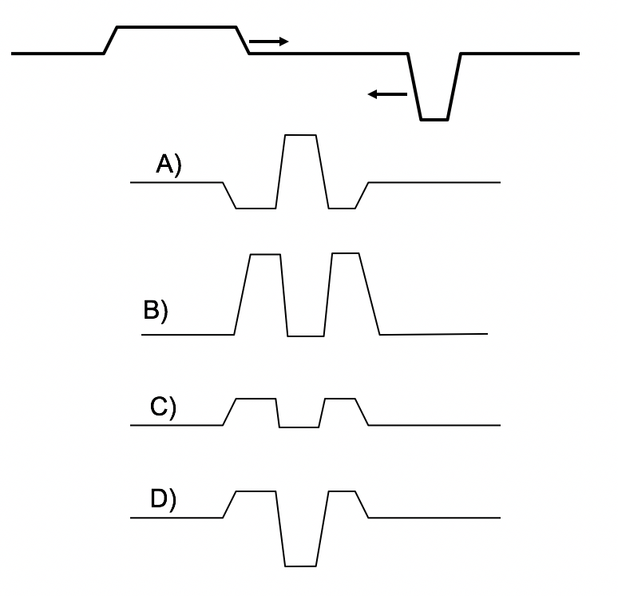

<section data-markdown>

Feynman’s Paradox:
Two charged balls are attached to a horizontal ring that can rotate  about a vertical axis without friction.  A solenoid with current I is on the axis.  Initially, everything is at rest.

The current in the solenoid is turned off. What is the direction of the induced $\mathbf{E}$ when viewed from the top?

1. 0
2. CW.
3. CCW.

Note:
* Correct Answer: B
</section>

<section data-markdown>

Feynman’s Paradox:
Two charged balls are attached to a horizontal ring that can rotate  about a vertical axis without friction.  A solenoid with current I is on the axis.  Initially, everything is at rest.

The current in the solenoid is turned off.
What happens to the charges?

1. They remain at rest
2. They rotate CW.
3. They rotate CCW.

Note:
* Correct Answer: B
</section>

<section data-markdown>

Does the Feynman device violate Conservation of Angular Momentum?

1. Yes
2. No
3. Neither, Cons of Ang Mom does not apply in this case.

Note:
* Correct Answer: B
</section>

<section data-markdown>

## Announcements

* Quiz Friday (Maxwell Ampere + Poynting Vector)
  * Determine the electric and magnetic field in a situation where there is a displacement current
  * Discuss the direction of the Poynting vector and how it relates to conservation of energy
* Your papers are due Friday (3/3) by 5pm (20% of your grade BTW)
    * As usual, you will use GitHub to turn them in.

</section>

<section data-markdown>

A function, $f(x,t)$, satisfies this PDE:

$$\dfrac{\partial^2 f}{\partial x^2} = \dfrac{1}{c^2}\dfrac{\partial^2 f}{\partial t^2}$$

*Invent two different functions $f(x,t)$ that solve this equation.  Try to make one of them "boring" and the other "interesting" in some way.*

</section>

<section data-markdown>

A function, $f(x,t)$, satisfies this PDE:

$$\dfrac{\partial^2 f}{\partial x^2} = \dfrac{1}{c^2}\dfrac{\partial^2 f}{\partial t^2}$$

Which of the following functions work?

1. $\sin( k(x – vt))$
2. $exp( k(-x – vt ))$
3. $a( x + vt )^3$
4. All of these.
5. None of these.

Note:
* Correct Answer: D

</section>

<section data-markdown>

A "right moving" solution to the wave equation is:

$$ f_R(z,t) = A \cos(kz – \omega t + \delta)$$

Which of these do you prefer for a "left moving" soln?

1. $f_L(z,t) = A \cos(kz + \omega t + \delta)$
2. $f_L(z,t) = A \cos(kz + \omega t - \delta)$
3. $f_L(z,t) = A \cos(-kz – \omega t + \delta)$
4. $f_L(z,t) = A \cos(-kz – \omega t - \delta)$
5. more than one of these!

(Assume $k, \omega, \delta$ are positive quantities)

</section>

<section data-markdown>

A "right moving" solution to the wave equation is:

$$ f_R(z,t) = A \cos(kz – \omega t + \delta)$$

How many of these could be a "left moving" soln?

* $f_L(z,t) = A \cos(kz + \omega t + \delta)$
* $f_L(z,t) = A \cos(kz + \omega t - \delta)$
* $f_L(z,t) = A \cos(-kz – \omega t + \delta)$
* $f_L(z,t) = A \cos(-kz – \omega t - \delta)$

Note:
* All of them could be because cos(x) = cos(-x)

</section>

<section data-markdown>

Two different functions $f_1(x,t)$ and $f_2(x,t)$ are solutions of the wave equation.

$$\dfrac{\partial^2 f}{\partial x^2} = \dfrac{1}{c^2}\dfrac{\partial^2 f}{\partial t^2}$$

Is $(A f_1  + B f_2 )$  also a solution of the wave equation?

1. Yes, always
2. No, never
3. Yes, sometimes depending on $f_1$ and $f_2$

Note:
* Correct answer: A

</section>

<section data-markdown>

Two traveling waves 1 and 2 are described by the equations:

$$y_1(x,t)  = 2 \sin(2x – t)$$
$$y_2(x,t)  =  4 \sin(x – 0.8 t)$$

All the numbers are in the appropriate SI (mks) units.
 
Which wave has the higher speed?
1. 1
2. 2
3. Both have the same speed

Note:
* Correct Answer: B

</section>

<section data-markdown>
Two impulse waves are approaching each other, as shown.  Which picture correctly shows the total wave when the two waves are passing through each other?

Note:
* Correct Answer: D

</section>

<section data-markdown>

A solution to the wave equation is:
$$f(z,t) = A \cos(kz – \omega t + \delta)$$

* What is the speed of this wave?
* Which way is it moving?
* If $\delta$ is small (and >0), is this wave "delayed" or "advanced"?
* What is the frequency?
* The angular frequency?
* The wavelength?
* The wave number?

</section>

<section data-markdown>

A solution to the wave equation is:
$$f(z,t) = Re\left[A e^{i(kz – \omega t + \delta)}\right]$$

* What is the speed of this wave?
* Which way is it moving?
* If $\delta$ is small (and >0), is this wave "delayed" or "advanced"?
* What is the frequency?
* The angular frequency?
* The wavelength?
* The wave number?

</section>

<section data-markdown>

A complex solution to the wave equation in 3D is:

$$\widetilde{f}(\mathbf{r},t) = \widetilde{A}e^{i(\mathbf{k}\cdot\mathbf{r}-\omega t)}$$

* What is the speed of this wave?
* Which way is it moving?
* Why is there no $\delta$?
* What is the frequency?
* The angular frequency?
* The wavelength?
* The wave number?

</section>
