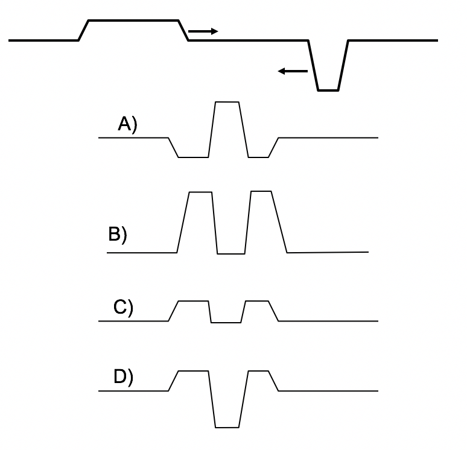

<section data-markdown>

A "right moving" solution to the wave equation is:

$$ f_R(z,t) = A \cos(kz – \omega t + \delta)$$

Which of these do you prefer for a "left moving" soln?

1. $f_L(z,t) = A \cos(kz + \omega t + \delta)$
2. $f_L(z,t) = A \cos(kz + \omega t - \delta)$
3. $f_L(z,t) = A \cos(-kz – \omega t + \delta)$
4. $f_L(z,t) = A \cos(-kz – \omega t - \delta)$
5. more than one of these!

(Assume $k, \omega, \delta$ are positive quantities)

Note:
* All of them could be because cos(x) = cos(-x)

</section>

<section data-markdown>

Two different functions $f_1(x,t)$ and $f_2(x,t)$ are solutions of the wave equation.

$$\dfrac{\partial^2 f}{\partial x^2} = \dfrac{1}{c^2}\dfrac{\partial^2 f}{\partial t^2}$$

Is $(A f_1  + B f_2 )$  also a solution of the wave equation?

1. Yes, always
2. No, never
3. Yes, sometimes depending on $f_1$ and $f_2$

Note:
* Correct answer: A

</section>

<section data-markdown>

Two traveling waves 1 and 2 are described by the equations:

$$y_1(x,t)  = 2 \sin(2x – t)$$
$$y_2(x,t)  =  4 \sin(x – 0.8 t)$$

All the numbers are in the appropriate SI (mks) units.
 
Which wave has the higher speed?
1. 1
2. 2
3. Both have the same speed

Note:
* Correct Answer: B

</section>

<section data-markdown>
Two impulse waves are approaching each other, as shown.  Which picture correctly shows the total wave when the two waves are passing through each other?

Note:
* Correct Answer: D

</section>

<section data-markdown>

A solution to the wave equation is:
$$f(z,t) = A \cos(kz – \omega t + \delta)$$

* What is the speed of this wave?
* Which way is it moving?
* If $\delta$ is small (and >0), is this wave "delayed" or "advanced"?
* What is the frequency?
* The angular frequency?
* The wavelength?
* The wave number?

</section>

<section data-markdown>

A solution to the wave equation is:
$$f(z,t) = Re\left[A e^{i(kz – \omega t + \delta)}\right]$$

* What is the speed of this wave?
* Which way is it moving?
* If $\delta$ is small (and >0), is this wave "delayed" or "advanced"?
* What is the frequency?
* The angular frequency?
* The wavelength?
* The wave number?

</section>

<section data-markdown>

A complex solution to the wave equation in 3D is:

$$\widetilde{f}(\mathbf{r},t) = \widetilde{A}e^{i(\mathbf{k}\cdot\mathbf{r}-\omega t)}$$

* What is the speed of this wave?
* Which way is it moving?
* Why is there no $\delta$?
* What is the frequency?
* The angular frequency?
* The wavelength?
* The wave number?

</section>

<section data-markdown>

Is "The Wave" at the stadium a transverse wave or a longitudinal wave?
1. Transverse
2. Longitudinal
3. Neither

Note:
* Correct Answer: A

</section>

<section data-markdown>

A wave on a stretched drum head is an example of a:
1. transverse wave
2. longitudinal wave
3. it's not a wave at all

Note:
* Correct Answer: A

</section>

<section data-markdown>

The electric field for a plane wave is given by:

$$\mathbf{E}(\mathbf{r},t) = \mathbf{E}_0e^{i(\mathbf{k}\cdot\mathbf{r} - \omega t)}$$

The vector $\mathbf{k}$ tells you:

1. The direction of the electric field vector.
2. The speed of the traveling wave.
3. The direction the plane wave moves.
4. A direction perpendicular to the direction the plane wave moves
5. None of these/MORE than one of these/???

Note:
* Correct Answer: C

</section>

<section data-markdown>

The electric field for a plane wave is given by:

$$\mathbf{E}(\mathbf{r},t) = \mathbf{E}_0e^{i(\mathbf{k}\cdot\mathbf{r} - \omega t)}$$

Suppose $\mathbf{E}_0$ points in the $+x$ direction.
Which direction is this wave moving?

1. The $x$ direction.
2. The radial ($r$) direction
3. A direction perpendicular to both $\mathbf{k}$ and $\mathbf{x}$
4. The $\mathbf{k}$ direction
5. None of these/MORE than one of these

Note:
* Correct Answer: D

</section>

<section data-markdown>

A wave is moving in the $+z$ direction:

$$f(x, y, z, t) = Re\left[A e^{i(kz – \omega t + \delta)}\right]$$

The value of $f$ at the point $(0,0,z_0, t)$ and the point at $(x, y, z_0 , t)$ are related how?

$f_1 = f (0,0,z_0 , t)$  vs.  $f_2  = f(x, y, z_0 , t)$

1. $f_1 = f_2$  always
2. $f_1 >$ or $<$ or $= f_2$  depending on the value of $x,y$

Note:
* Correct Answer: A

</section>
