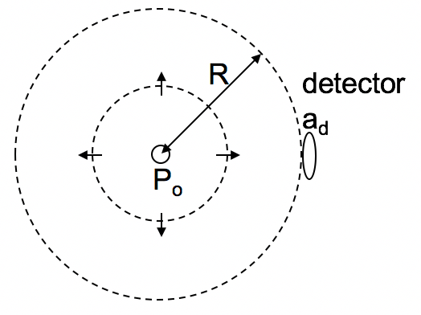

<section data-markdown>

The electric field of an E/M wave is described by:

$$\mathbf{E} = E_0\sin\left(kx-\omega t\right)\hat{\mathbf{y}}$$

What is the direction of the magnetic field?

1. $+x$
2. $+y$
3. $–x$
4. $+z$
5. $-z$

Note:
* Correct Answer: D

</section>

<section data-markdown>

You have this solution to Maxwell's equations in vacuum:

$$\widetilde{\mathbf{E}}(x,y,z,t) = \widetilde{\mathbf{E}}_0 \exp\left[i\left(\mathbf{k}\cdot\mathbf{r} - \omega t\right)\right]$$

If this wave travels in the $y$ direction, is polarized in the $x$ direction, and has a complex phase of 0, what is the $x$ component of the physical wave?

1. $E_x = E_0 \ cos\left(kx-\omega t\right)$
2. $E_x = E_0 \ cos\left(ky-\omega t\right)$
3. $E_x = E_0 \ cos\left(kz-\omega t\right)$
4. $E_x = E_0 \ cos\left(k_x x+k_y y-\omega t\right)$
5. Something else

Note:
* Correct Answer: B

</section>

<section data-markdown>

An electromagnetic plane wave propagates to the right.  Four vertical antennas are labeled 1-4. 1, 2, and 3 lie in the $x-y$ plane.  1, 2, and 4 have the same $x$-coordinate, but antenna 4 is located further out in the $z$-direction.
Rank the time-averaged signals received by each antenna.

1. 1=2=3$>$4
2. 3$>$2$>$1=4
3. 1=2=4$>$3
4. 1=2=3=4
5. 3$>$1=2=4

Note:
* Correct Answer: D

</section>

<section data-markdown>

A point source of radiation emits power $P_0$ isotropically (uniformly in all directions).  A detector of area $a_d$ is located a distance $R$ away from the source.  What is the power $P_d$ received by the detector?

1. $\frac{P_0}{4\pi R^2}a_d$
2. $P_0\frac{a_d^2}{R^2}$
3. $P_0\frac{a_d}{R}$
4. $\frac{P_0}{\pi R^2}a_d$
5. None of these

Note:
* Correct Answer: A

</section>
