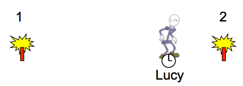

<section data-markdown>

**True or False:** EM Waves can have velocities higher than $c$.

1. True
2. False
3. I don't know what to believe anymore

Note:
* Correct answer: A

</section>

<section data-markdown>

Fourier tells us that we can write a "pulse" by summing up sinusoidal functions:

$f(x) = \int_{-\infty}^{\infty} a(k)e^{ikx}dk$

If we were to compute $f(x) = \int_{-\infty}^{\infty} a(k)e^{ik(x-vt)}dk$ where $v$ is a known constant, what would we get?

1. $f(x)$
2. $f(vt)$
3. $f(x-vt)$
4. Something complicated!
5. ???

Note:
* Correct Answer: C

</section>

<section data-markdown>

Fourier tells us that we can write a "pulse" by summing up sinusoidal functions:

$f(x) = \int_{-\infty}^{\infty} a(k)e^{ikx}dk$

If we were to compute $f(x) = \int_{-\infty}^{\infty} a(k)e^{ik(x-v(k)t)}dk$ where $v(k)$ is function, what would we get?

1. $f(x)$
2. $f(vt)$
3. $f(x-vt)$
4. Something more complicated!
5. ???

Note:
* Correct Answer: D

</section>

<section data-markdown>

Two major results of special relativity are Time Dilation and Lorentz Contraction. Please pick one of the choices below which best describes how well you feel you understand them.

1. No idea what these effects are
2. I remember having heard about these, but couldn't define them precisely right now.
3. I know what these effects are, (but I've forgotten how to derive them)
4. I know what these effects are, and I even sort of remember the derivation, but it would take me a while to sort it out
5. I'm confident I could derive these results right now

</section>

<section data-markdown>

You are standing next to a conveyer belt that is transporting a baby (don't ask questions) at 1 m/s **to the right**. The baby is crawling at **2 m/s to the right**. What is the velocity of the baby in your frame?

1. 1 m/s to the left
2. 1 m/s to the right
3. 3 m/s to the right
4. 3 m/s to the left
5. Something else

Note:
* Correct Answer: C

</section>

<section data-markdown>

You are standing next to a conveyer belt that is transporting a baby (don't ask questions) at **1 m/s to the right**. The baby is crawling at **2 m/s to the left**. What is the velocity of the baby in your frame?

1. 1 m/s to the left
2. 1 m/s to the right
3. 3 m/s to the right
4. 3 m/s to the left
5. Something else

Note:
* Correct Answer: A

</section>

<section data-markdown>

## Demo

[Galilean relativity example courtesy of Jamiroquai](https://vimeo.com/58139812)

</section>

<section data-markdown>

Standing on a moving walkway in the airport that is moving at 1 m/s to the right, you toss a ball into the air. You observe the ball moving straight up and down.

I'm sitting on a bench watching your shenanigans. What do I have to do to make my physics match yours? That is, what do I have to do to reproduce all your measurements?

1. Add 1 m/s to the left
2. Add 1 m/s to the right
3. Subtract 1 m/s to the right
4. Subtract 1 m/s to the left
5. None or more than one of these

Note:
* Correct Answer: E (it's A and C)

</section>

<section data-markdown>

A rocket is moving to the right at speed $v = (3/4)c$, relative to Earth.  On the  front of the rocket is a headlight which emits a flash of light.

In the reference frame of a passenger on the rocket, the speed of the light flash is

1. $c$
2. 7/4 $c$
3. 1/4 $c$
4. None of these

Note:
* Correct Answer: A

</section>

<section data-markdown>

A rocket is moving to the right at speed $v = (3/4)c$, relative to Earth.  On the  front of the rocket is a headlight which emits a flash of light.

According to a person at rest on the earth, the speed of the light flash is

1. $c$
2. 7/4 $c$
3. 1/4 $c$
4. None of these

Note:
* Correct Answer: A

</section>

<section data-markdown>

A rocket is moving to the right at speed $v = (3/4)c$, relative to Earth.  On the  front of the rocket is a headlight which emits a flash of light.

According to a person moving toward the rocket at speed $(3/4)c$, relative to earth, the speed of the light flash is

1. $c$
2. 7/4 $c$
3. 1/4 $c$
4. None of these

Note:
* Correct Answer: A

</section>

<section data-markdown>

A light bulb flashes in the center of a train car that is moving at speed v with respect to the ground.  In the frame of reference of the train car, light wave from the flash strikes the front and back of the train simultaneously.

In the frame of reference of the ground, the light strikes the back of the train **(fill in the blank)** the light strikes the front of the train.

1. before
2. after
3. at the same time as

Note:
* Correct Answer: A
</section>

<section data-markdown>

Two firecrackers explode. Lucy, halfway between the firecrackers, sees them explode at the same time. Ricky (same reference frame as Lucy) is next to firecracker 2. According to Ricky, which firecracker explodes first?

1. Both explode at the same time
2. Firecracker 1 explodes first
3. Firecracker 2 explodes first

*Hint: Separate what Ricky "sees" from what he would observe.*

Note:
* Correct Answer: A

</section>

<section data-markdown>

Two firecrackers sitting on the ground explode. This time, Lucy is sitting twice as far from firecracker 1 as from firecracker 2. She sees the explosions at the same time. Which firecracker exploded first in Lucy’s reference frame?

1. Both explode at the same time
2. Firecracker 1 explodes first
3. Firecracker 2 explodes first

</section>

<section data-markdown>

In which frame of reference is the time between tics of the clock **longer**?

1. Rest frame of clock
2. moving frame
3. no difference

Note:
* Correct Answer: B

</section>

<section data-markdown>

What is the **minimum** number of observers needed in the **rest frame** to measure the "tic"?

1. 1
2. 2
3. 3
4. More than 3
5. ???

Note:
* Correct Answer: A

</section>

<section data-markdown>

What is the **minimum** number of observers needed in the **moving frame** to measure the "tic"?

1. 1
2. 2
3. 3
4. More than 3
5. ???

Note:
* Correct Answer: B

</section>

<section data-markdown>

I have a stick of length $L$ sitting in front of me. In the reference frame of a passing train, (moving parallel to the stick) what is the measured length of the stick?

1. $L$
2. $\gamma L$
3. $L/\gamma$
4. I'm sure it's B or C, but not sure which one
5. It depends

Note:
* Correct Answer: C

</section>

<section data-markdown>

In particle decay the rate of decay is proportional to the number of particles left,

$$\dfrac{dN}{dt} = -\lambda N$$

If we start with $N_0$ particles, what's the fraction of remaning particles in a time $\Delta t$?

1. $N_0 e^{-\lambda \Delta t}$
2. $N_0 e^{+\lambda \Delta t}$
3. $N_0 e^{-\Delta t/\lambda}$
4. $N_0 e^{+\Delta t/\lambda}$
5. Something else

Note:
* Correct answer: E
* It's a fraction, so it's A without the number
</section>

<section data-markdown>

In a particle detection experiment, the fraction of particles detected is:

1. underestimated
2. overestimated
3. the same as

if we use the time of flight in the detector frame.

Note:
* Correct Answer: A

</section>
