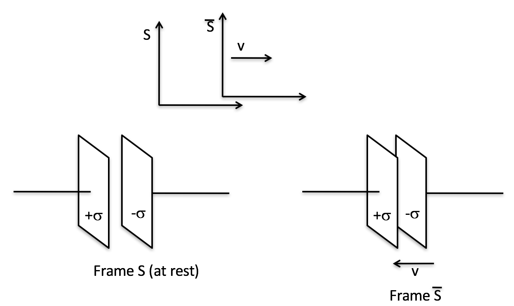

<section data-markdown>

A charge $q$ is moving with velocity $\mathbf{u}$ in a uniform magnetic field $\mathbf{B}$.

$$\mathbf{F} = q\mathbf{u}\times\mathbf{B} = m\mathbf{a}$$

If we switch to a different Galilean frame (a low speed Lorentz transform), is the acceleration $\mathbf{a}$ different?

1. Yes
2. No

Note:
* Correct answer: B

</section>

<section data-markdown>

A charge $q$ is moving with velocity $\mathbf{u}$ in a uniform magnetic field $\mathbf{B}$.

$$\mathbf{F} = q\mathbf{u}\times\mathbf{B} = m\mathbf{a}$$

If we switch to a different Galilean frame (a low speed Lorentz transform), is the particle velocity $\mathbf{u}$ different?

1. Yes
2. No

Note:
* Correct answer: A

</section>

<section data-markdown>

A charge $q$ is moving with velocity $\mathbf{u}$ in a uniform magnetic field $\mathbf{B}$.

$$\mathbf{F} = q\mathbf{u}\times\mathbf{B} = m\mathbf{a}$$

If we switch to a different Galilean frame (a low speed Lorentz transform), is the magnetic field $\mathbf{B}$ different?

1. Yes
2. No

Note:
* Correct answer: A

</section>

<section data-markdown>

A charge $q$ is moving with velocity $\mathbf{u}$ in a uniform magnetic field $\mathbf{B}$.

$$\mathbf{F} = q\mathbf{u}\times\mathbf{B} = m\mathbf{a}$$

Suppose we switch to frame with $\mathbf{v} = \mathbf{u}$, so that in the primed frame, $\mathbf{u}’ = 0$ (the particle is instantaneously at rest). Does the particle feel a force from an E-field in this frame?

1. Yes
2. No
3. depends on details

Note:
* Correct answer: A
</section>

<section data-markdown>

## Announcements

* Extra credit assessment (Wednesday)
  * Replaces second-lowest HW grade
* Last class (Friday)
  * Wrap up and discussion
* Poster presentations (Monday, May 1 from 3-5pm in 1300 BPS)
  * Hand out list of posters to review
  * Hand out review sheets to complete

</section>

<section data-markdown>

Minkowski suggested a better way to write $K^{\mu}$ is in terms of the field tensor, $F^{\mu\nu}$,

$$K^{\mu} = \dfrac{dp^{\mu}}{d\tau} = q\eta_{\nu}F^{\mu\nu}$$

What are the units of the components of the field tensor?

1. ${\frac{N}{m}}$
2. ${T}$
3. ${\frac{Ns}{Cm}}$
4. ${\frac{V}{m}}$
5. None or more than one of these

Note:
* Correct Answer: E (it's B and C)
</section>

<section data-markdown>

Switch from frame $S$ to frame $\bar{S}$:

How does $E_x$ compare to $\bar{E}_x$?

1. $\bar{E}_x = E_x$
2. $\bar{E}_x > E_x$
3. $\bar{E}_x < E_x$

Note:
* Correct answer: A

</section>
